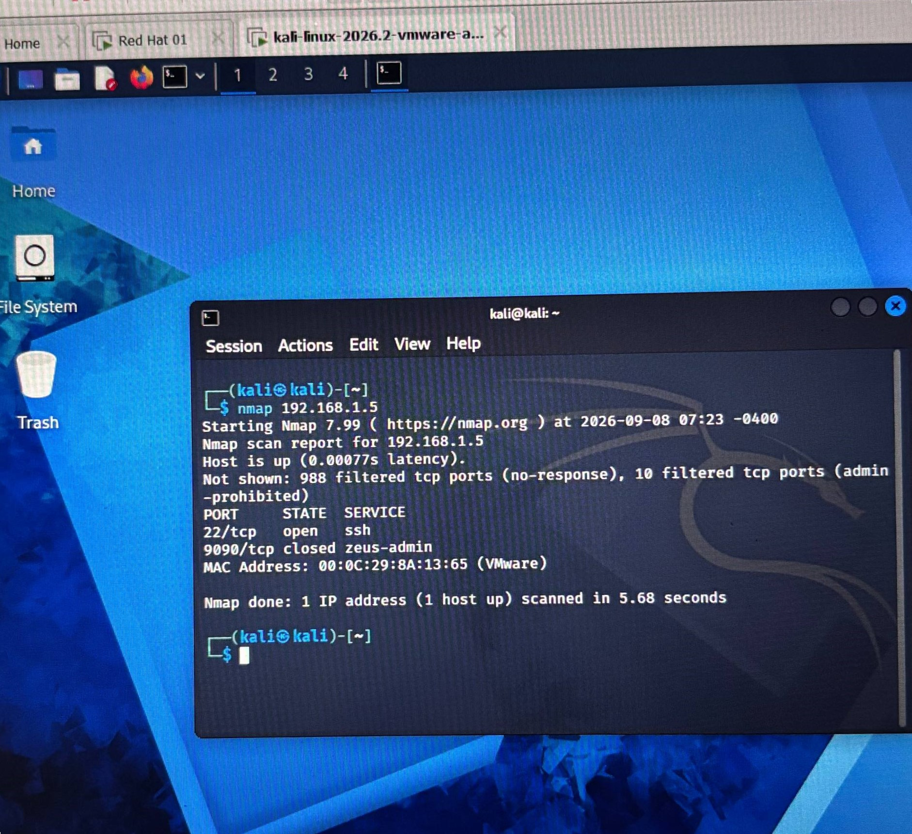
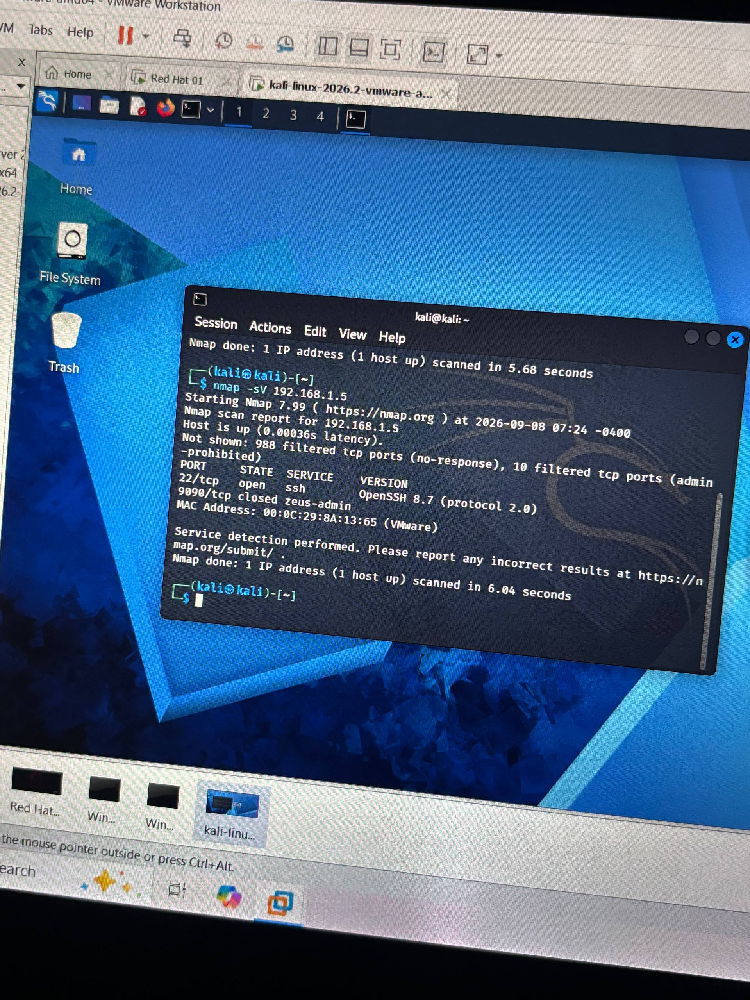
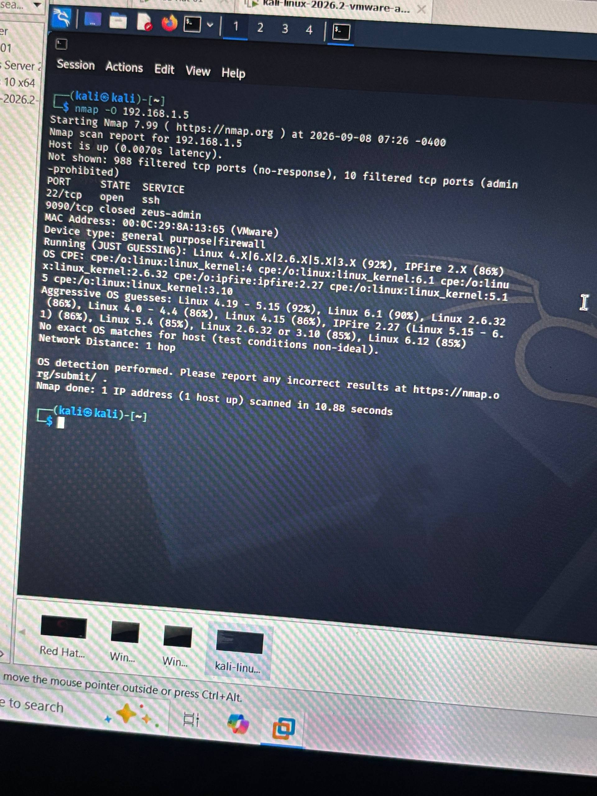

#Nmap Network Reconnaissance & Service Enumeration

## 1. Objective

The objective of this project is to perform network reconnaissance and service enumeration against a controlled virtual machine environment using Nmap.

The project demonstrates how Nmap can be used to identify reachable hosts, discover open ports, and identify running services.

## 2. Lab Environment
| Component | Details |
|---|---|
| Attacker Machine | Kali Linux |
| Target Machine | Red Hat Linux |
| Virtualization | VMware |
| Network | VMware NAT |
| Target IP | 192.168.1.5 |
| Tool | Nmap

## 3. Methodology

### Step 1 — Connectivity Test

A ping test was performed to verify connectivity between the Kali Linux machine and the target machine.

ping -c 4 192.168.1.5
screenshots/01-connectivity.jpg
Step 2 — Basic Port Scan

A basic Nmap scan was performed to identify open ports on the target machine.
nmap 192.168.1.5

Step3 — Service Enumeration

Service and version detection was performed to identify the services running on the discovered ports.
nmap -sV 192.168.1.5

Step 4 — OS Detection

OS detection was performed to identify the operating system of the target machine.
nmap -O 192.168.1.5

## 4. Findings
### Finding 1 — SSH Service Exposed
TCP port 22 was found open and running OpenSSH 8.7.

This indicates that the target machine accepts SSH connections from the network.

An open SSH port is not necessarily a vulnerability, but it should be properly secured and restricted to authorized users and trusted sources.

### Finding 2 — Port 9090 Closed

TCP port 9090 was found closed during the targeted scan.

No accessible service was identified on this port.

## 5. Security Recommendations

-Restrict SSH access to authorized users and trusted networks.
-Use strong authentication mechanisms for SSH.
-Keep the SSH service updated.
-Disable unnecessary services and ports.
-Monitor remote-access activity for suspicious connections.

## 6.Conclusion

This project demonstrated a basic network reconnaissance workflow using Nmap.

The assessment included connectivity testing, port discovery, service enumeration, and OS detection. The main exposed service identified was SSH on TCP port 22 running OpenSSH 8.7.

